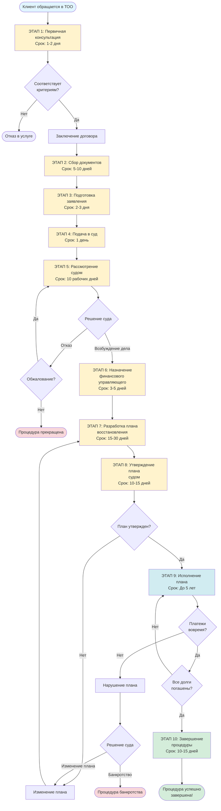
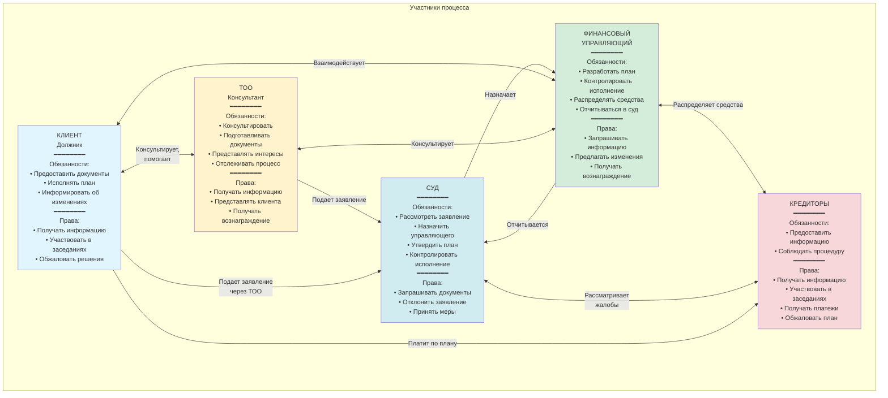
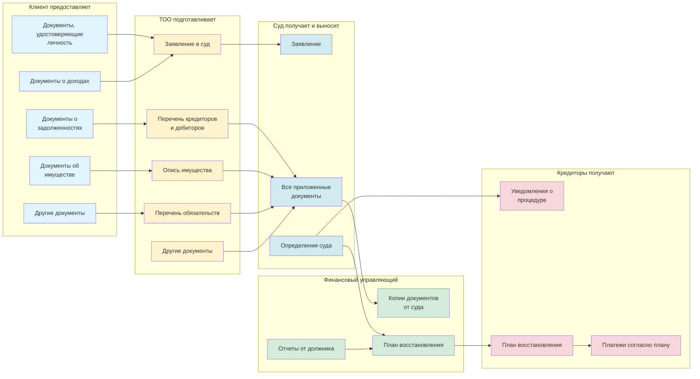
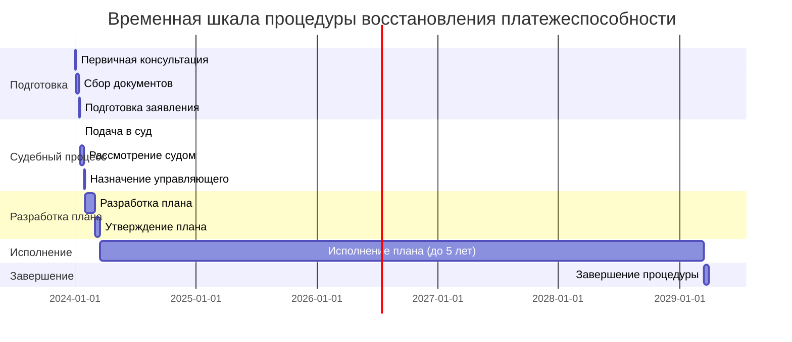
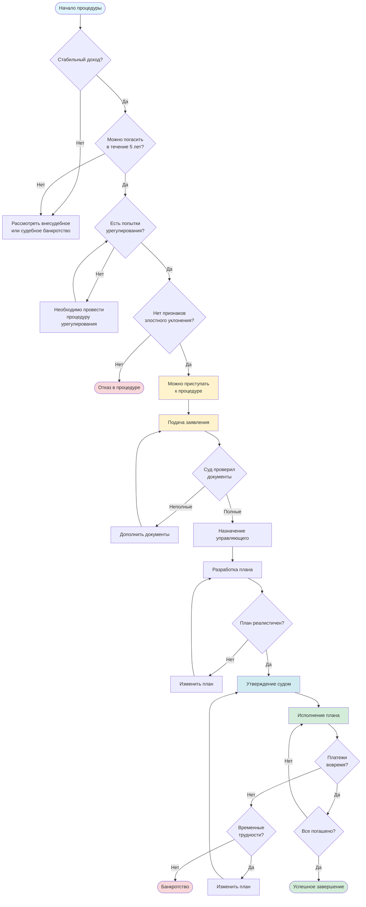
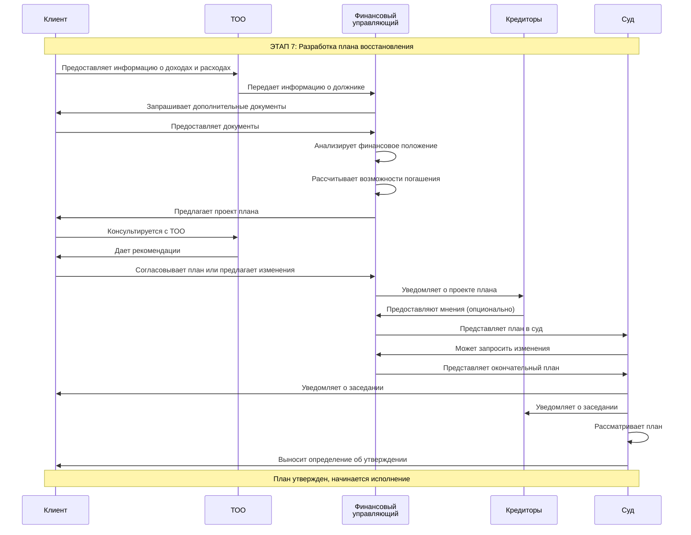
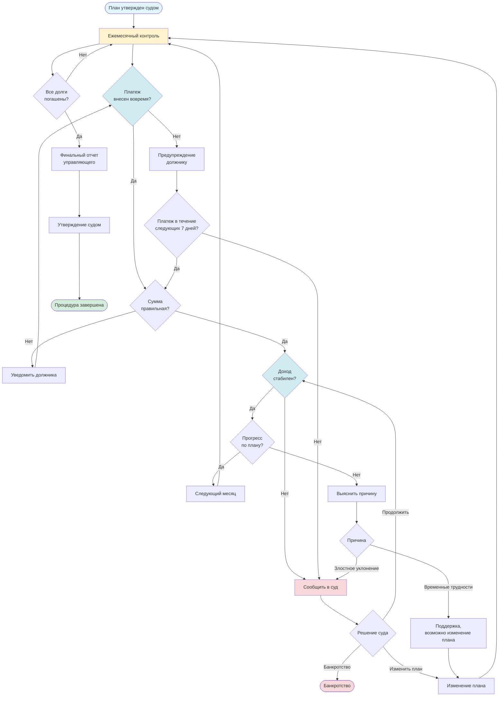

# Визуальная схема процесса восстановления платежеспособности

## Диаграмма процесса (Mermaid)

## Схема ролей и взаимодействий

## Схема документооборота

## Временная шкала процесса

## Схема принятия решений

## Схема взаимодействия на этапе разработки плана

## Схема контроля исполнения плана

---

## Как использовать эти схемы

1. **Диаграмма процесса** - показывает полный флоу от начала до конца процедуры
2. **Схема ролей** - описывает всех участников и их взаимодействие
3. **Схема документооборота** - показывает, какие документы передаются между участниками
4. **Временная шкала** - визуализирует сроки каждого этапа
5. **Схема принятия решений** - помогает определить, подходит ли процедура клиенту
6. **Схема взаимодействия** - детализирует процесс разработки плана
7. **Схема контроля** - показывает, как контролируется исполнение плана

Эти схемы можно использовать:
- Для презентаций клиентам
- Для обучения сотрудников
- Для создания инфографики
- Для веб-сайта компании
- Для печатных материалов

---

*Схемы созданы в формате Mermaid и могут быть визуализированы с помощью различных инструментов (GitHub, GitLab, онлайн-редакторы Mermaid и др.)*

