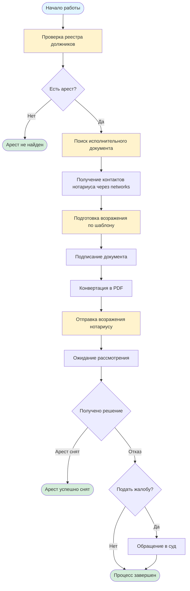

# Снятие ареста с должника

## Описание услуги

Услуга включает полный процесс снятия ареста с имущества должника через подготовку и подачу возражений нотариусу, работу с исполнительными документами и взаимодействие с органами исполнительного производства.

## Пошаговая инструкция по снятию ареста

### Шаг 1: Проверка реестра должников

**Описание:** Проверка наличия должника в реестре и получение информации о наложенных арестах.

**Инструкция:**
1. Зайти на портал [aisoip.adilet.gov.kz/debtors](https://aisoip.adilet.gov.kz/debtors)
2. Выбрать вкладку в зависимости от типа проверяемого лица:
   - "Жеке тұлғалар" (Физические лица)
   - "Заңды тұлғалар" (Юридические лица)
   - "Шетелдік тұлғалар" (Иностранные лица)
3. Для физических лиц ввести:
   - ИИН (ЖСН) - индивидуальный идентификационный номер, или
   - ТАӘ - временное адресное назначение
4. Для юридических лиц ввести БИН
5. Нажать кнопку "Іздеу" (Поиск)
6. Получить информацию о наличии в реестре должников
7. При наличии - получить детальную информацию о задолженностях, исполнительных производствах и наложенных арестах

**Важно:** Авторизация не требуется для базового поиска в реестре. Поиск доступен всем пользователям без регистрации.

**Необходимые документы:**
- ИИН (для физических лиц)
- Или ТАӘ (для физических лиц без ИИН)
- БИН (для юридических лиц)

**Сроки выполнения:** Мгновенно (онлайн-поиск)

**Официальные источники:**
- [aisoip.adilet.gov.kz - Реестр должников](https://aisoip.adilet.gov.kz/debtors)

---

### Шаг 2: Поиск исполнительного документа

**Описание:** Получение информации об исполнительном документе, на основании которого наложен арест.

**Инструкция:**
1. Зайти на портал [aisoip.adilet.gov.kz/documents/search-enforcement-doc](https://aisoip.adilet.gov.kz/documents/search-enforcement-doc)
2. Заполнить форму поиска одним из способов:
   - **Вариант 1:** Ввести номер исполнительного документа (если известен)
   - **Вариант 2:** Ввести ИИН должника (для физических лиц)
   - **Вариант 3:** Ввести БИН должника (для юридических лиц)
3. Нажать кнопку "Найти"
4. Получить информацию об исполнительном документе, включая:
   - Номер исполнительного документа
   - Данные о судебном исполнителе
   - Информацию о кредиторе
   - Детали исполнительного производства
   - Информацию о наложенных арестах

**Важно:** Авторизация не требуется для поиска. Поиск доступен всем пользователям без регистрации.

**Необходимые документы:**
- ИИН или БИН должника
- Или номер исполнительного документа (если известен)

**Сроки выполнения:** Мгновенно (онлайн-поиск)

**Официальные источники:**
- [aisoip.adilet.gov.kz - Поиск исполнительного документа](https://aisoip.adilet.gov.kz/documents/search-enforcement-doc)

---

### Шаг 3: Получение контактных данных нотариуса

**Описание:** Получение номера телефона и других контактных данных нотариуса, который наложил арест.

**Инструкция:**
1. После получения информации об исполнительном документе (Шаг 2), найти данные о нотариусе
2. Открыть инструменты разработчика браузера (F12 или правый клик → "Просмотреть код")
3. Перейти во вкладку "Network" (Сеть)
4. Обновить страницу или выполнить поиск заново
5. В списке сетевых запросов найти запросы, содержащие информацию о нотариусе
6. Просмотреть ответы (Response) на запросы, где можно найти:
   - Номер телефона нотариуса
   - Адрес нотариальной конторы
   - Email нотариуса (если доступен)
   - Другие контактные данные

**Альтернативные способы:**
- Контактные данные нотариуса могут быть указаны в результатах поиска на сайте
- Можно обратиться в территориальное управление юстиции для получения контактов нотариуса

**Сроки выполнения:** 5-15 минут

---

### Шаг 4: Подготовка возражения нотариусу

**Описание:** Подготовка письма-возражения на действия нотариуса по наложению ареста.

**Инструкция:**
1. Изучить основания для возражения:
   - Нарушение процедуры наложения ареста
   - Отсутствие законных оснований для ареста
   - Превышение полномочий нотариусом
   - Нарушение прав должника
2. Использовать шаблон возражения (см. файл `возражение1.docx` в папке)
3. Заполнить шаблон, указав:
   - ФИО, ИИН должника
   - Данные нотариуса (ФИО, номер телефона, адрес)
   - Номер исполнительного документа
   - Основания для возражения с указанием конкретных нарушений
   - Правовые нормы, которые были нарушены
   - Требования (снятие ареста, отмена постановления и т.д.)
   - Список приложенных документов
4. Приложить документы, подтверждающие возражение:
   - Копии решений суда
   - Копии постановлений нотариуса
   - Документы, подтверждающие отсутствие оснований для ареста
   - Другие документы, имеющие значение для дела

**Шаблоны документов:**
- `возражение1.docx` - шаблон письма-возражения нотариусу (находится в папке)
- Электронная версия шаблона: [Google Docs](https://docs.google.com/document/d/1pljb7UTkiZXl9KqOnaRBxiiGvJcQseN8EoRQDcdIyaI/edit?usp=sharing)

**Необходимые документы:**
- Шаблон возражения
- Документы, подтверждающие основания для возражения
- Копии решений, постановлений
- Удостоверение личности должника
- ИИН или БИН

**Сроки выполнения:** 1-2 дня

**Официальные источники:**
- Гражданский процессуальный кодекс РК
- Закон РК "Об исполнительном производстве и статусе судебных исполнителей"
- Закон РК "О нотариате"

---

### Шаг 5: Подготовка электронной цифровой подписи (ЭЦП)

**Описание:** Получение ЭЦП для подписания документов в электронном виде (при необходимости).

**Инструкция:**
1. Обратиться в удостоверяющий центр (НУЦ РК или аккредитованные центры)
2. Подать заявление на получение ЭЦП
3. Предоставить документы:
   - Удостоверение личности
   - ИИН
   - СНИЛС (при наличии)
4. Оплатить услугу
5. Получить ЭЦП на носителе или в облаке

**Необходимые документы:**
- Удостоверение личности
- ИИН
- СНИЛС (при наличии)

**Сроки выполнения:** 1-3 рабочих дня

**Официальные источники:**
- [НУЦ РК](https://pki.gov.kz) - Национальный удостоверяющий центр

**Примечание:** ЭЦП требуется только при отправке документов в электронном виде. При личной подаче или отправке почтой ЭЦП не требуется.

---

### Шаг 6: Подписание документа

**Описание:** Подписание подготовленного возражения.

**Инструкция:**
1. Распечатать подготовленное возражение (если отправка будет почтой или лично)
2. Подписать документ собственноручно
3. Поставить дату подписания

**Для электронной отправки:**
1. Открыть документ для подписания
2. Установить программное обеспечение для работы с ЭЦП (если не установлено)
3. Вставить носитель с ЭЦП или использовать облачную ЭЦП
4. Ввести PIN-код
5. Подписать документ
6. Сохранить подписанный документ

**Необходимые документы:**
- Подготовленное возражение
- ЭЦП (только для электронной отправки)

**Сроки выполнения:** 5-10 минут

---

### Шаг 7: Конвертация документа в PDF

**Описание:** Конвертация документов в формат PDF для отправки в электронном виде.

**Инструкция:**
1. Открыть документ в программе (Word, Excel и т.д.)
2. Выбрать "Сохранить как" или "Экспорт"
3. Выбрать формат PDF
4. Настроить параметры (качество, размер)
5. Сохранить файл
6. Проверить качество PDF-файла

**Альтернативные способы:**
- Использовать онлайн-конвертеры
- Использовать сканер для сканирования бумажных документов в PDF

**Сроки выполнения:** 5-10 минут

---

### Шаг 8: Отправка возражения нотариусу

**Описание:** Отправка подготовленного письма-возражения нотариусу.

**Инструкция:**
1. Подготовить письмо-возражение (см. Шаг 4)
2. Подписать документ (см. Шаг 6)
3. Конвертировать в PDF (см. Шаг 7) - при электронной отправке
4. Выбрать способ отправки:

   **Вариант 1: Почтовая отправка (рекомендуется)**
   - Отправить заказное письмо с уведомлением о вручении
   - Сохранить квитанцию об отправке
   - Дождаться уведомления о вручении

   **Вариант 2: Личная подача**
   - Прийти в нотариальную контору лично
   - Подать документы в канцелярию нотариуса
   - Получить отметку о принятии документов

   **Вариант 3: Электронная отправка**
   - Отправить на email нотариуса (если нотариус принимает документы по email)
   - Использовать ЭЦП для подписания
   - Сохранить подтверждение отправки

5. Получить подтверждение о получении документов нотариусом

**Необходимые документы:**
- Письмо-возражение (оригинал + копия для себя)
- Копии приложенных документов
- Квитанция об отправке (при почтовой отправке)

**Сроки выполнения:** 1 день

**Официальные источники:**
- Закон РК "О нотариате"
- Закон РК "Об исполнительном производстве"

---

### Шаг 9: Отслеживание рассмотрения возражения

**Описание:** Контроль за рассмотрением возражения и получение решения нотариуса.

**Инструкция:**
1. После отправки возражения ожидать рассмотрения (обычно 5-10 рабочих дней)
2. Связаться с нотариусом по телефону (полученному через networks, см. Шаг 3) для уточнения статуса рассмотрения
3. Проверить почту (если указали email для ответа)
4. При личной подаче - периодически звонить в канцелярию нотариуса
5. Получить решение нотариуса:
   - Постановление об удовлетворении возражения и снятии ареста
   - Или постановление об отказе в удовлетворении возражения

**Сроки рассмотрения:** 5-10 рабочих дней с момента получения документов нотариусом

---

### Шаг 10: Действия после получения решения

**Описание:** Действия в зависимости от решения нотариуса.

**Если арест снят:**
1. Получить постановление нотариуса о снятии ареста
2. Проверить в реестре должников (Шаг 1), что арест действительно снят
3. Сохранить все документы для архива
4. Уведомить заинтересованные стороны (если необходимо)

**Если возражение отклонено:**
1. Получить постановление об отказе
2. Изучить основания отказа
3. При наличии оснований - подготовить жалобу в суд на действия нотариуса
4. Обратиться к юристу для консультации по дальнейшим действиям

**Сроки выполнения:** Зависит от решения нотариуса

---

## Визуальная схема процесса

---

## Шаблоны документов

В папке находятся следующие шаблоны:

1. **возражение1.docx** - шаблон письма-возражения нотариусу о снятии ареста
   - Электронная версия: [Google Docs](https://docs.google.com/document/d/1pljb7UTkiZXl9KqOnaRBxiiGvJcQseN8EoRQDcdIyaI/edit?usp=sharing)

**Как использовать шаблон:**
1. Открыть файл `возражение1.docx`
2. Заменить все данные в квадратных скобках [ ] на актуальные данные
3. Заполнить основания для возражения
4. Добавить ссылки на правовые нормы
5. Указать требования
6. При необходимости добавить дополнительные разделы

---

## Общие рекомендации

1. **Всегда проверяйте актуальность информации** на официальных сайтах
2. **Сохраняйте копии всех документов** перед отправкой
3. **Используйте заказные письма** с уведомлением для важных документов
4. **Ведите учет всех отправленных документов** с датами и номерами
5. **Соблюдайте сроки** подачи документов и возражений
6. **Сохраняйте все документы** для возможного обжалования
7. **При сомнениях обращайтесь к юристу** для консультации

---

## Полезные ссылки

- [aisoip.adilet.gov.kz - Реестр должников](https://aisoip.adilet.gov.kz/debtors) - Проверка наличия в реестре и информации об арестах
- [aisoip.adilet.gov.kz - Поиск исполнительного документа](https://aisoip.adilet.gov.kz/documents/search-enforcement-doc) - Поиск исполнительных документов по ИИН/БИН
- [НУЦ РК](https://pki.gov.kz) - Национальный удостоверяющий центр для получения ЭЦП
- [Верховный суд РК](https://sud.gov.kz) - Информация о судебных процедурах

---

## Контакты для справок

- Телефон поддержки АИС ОИП: +7 (7172) 955-600
- Email поддержки: support_aisoip@alseco.kz

---

## Важные замечания

1. **Сроки подачи возражения:** Возражение должно быть подано в течение срока, установленного законом (обычно 10 дней с момента получения постановления об аресте)
2. **Обязательность документов:** Все документы должны быть оформлены правильно, иначе возражение может быть отклонено
3. **Правовые основания:** Возражение должно содержать конкретные правовые основания для снятия ареста
4. **Доказательства:** К возражению должны быть приложены документы, подтверждающие основания для снятия ареста
