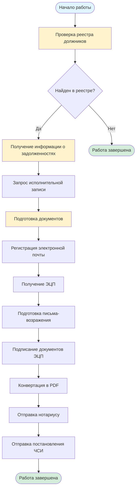

# Работа с реестром должников и исполнительными документами

## Описание услуги

Услуга включает работу с реестром должников, запрос исполнительных записей, подготовку возражений нотариусу и отправку необходимых документов в государственные органы.

## Подзаголовки услуг

### 1.1 Пояснения
**Описание:** Общие пояснения по работе с реестром должников и исполнительными документами.

**Инструкция:**
1. Изучить законодательство РК о реестре должников
2. Понять процедуру работы с исполнительными документами
3. Ознакомиться с правами и обязанностями должника

**Необходимые документы:**
- Удостоверение личности
- Документы, подтверждающие задолженность

**Официальные источники:**
- Закон РК "Об исполнительном производстве и статусе судебных исполнителей"
- Портал egov.kz

---

### 1.2 Реестр должников
**Описание:** Работа с реестром должников - проверка наличия в реестре, получение информации о задолженностях.

**Инструкция:**
1. Зайти на портал egov.kz
2. Авторизоваться с помощью ЭЦП
3. Перейти в раздел "Реестр должников"
4. Ввести ИИН для проверки
5. Получить информацию о наличии в реестре
6. При наличии - получить детальную информацию о задолженностях

**Необходимые документы:**
- ЭЦП (электронная цифровая подпись)
- ИИН

**Сроки выполнения:** 1 рабочий день

**Официальные источники:**
- [egov.kz - Реестр должников](https://egov.kz)

---

### 1.3 Запрос исполнительной записи
**Описание:** Получение исполнительной записи (исполнительного листа) для работы с задолженностями.

**Инструкция:**
1. Обратиться в суд, вынесший решение
2. Подать заявление о выдаче исполнительной записи
3. Предоставить документы:
   - Копию решения суда
   - Удостоверение личности
   - ИИН
4. Получить исполнительную запись
5. Заверить копию у нотариуса (при необходимости)

**Необходимые документы:**
- Копия решения суда
- Удостоверение личности
- ИИН
- Заявление о выдаче исполнительной записи

**Сроки выполнения:** 5-10 рабочих дней

**Официальные источники:**
- Закон РК "Об исполнительном производстве"
- Суды РК

---

### 1.4 Второй способ выгрузки надписи
**Описание:** Альтернативный способ получения исполнительной записи через электронные сервисы.

**Инструкция:**
1. Зайти на портал egov.kz
2. Авторизоваться с помощью ЭЦП
3. Перейти в раздел "Судебные услуги"
4. Выбрать "Получение исполнительной записи"
5. Заполнить электронное заявление
6. Приложить необходимые документы в электронном виде
7. Получить исполнительную запись в электронном виде

**Необходимые документы:**
- ЭЦП
- Электронные копии документов

**Сроки выполнения:** 3-5 рабочих дней

**Официальные источники:**
- [egov.kz](https://egov.kz)

---

### 1.5 Регистрация электронной почты
**Описание:** Регистрация электронной почты для работы с государственными сервисами.

**Инструкция:**
1. Выбрать почтовый сервис (mail.ru, gmail.com, yandex.kz)
2. Зарегистрировать новый почтовый ящик
3. Подтвердить регистрацию через SMS или телефон
4. Настроить почтовый ящик
5. Использовать для регистрации на egov.kz и других государственных порталах

**Необходимые документы:**
- Номер телефона для подтверждения

**Сроки выполнения:** 10-15 минут

---

### 1.6 Заполнение письма возражение
**Описание:** Подготовка письма-возражения на действия нотариуса или судебного исполнителя.

**Инструкция:**
1. Изучить основания для возражения
2. Подготовить письмо-возражение, указав:
   - ФИО, ИИН должника
   - Основания для возражения
   - Правовые нормы
   - Требования
3. Приложить документы, подтверждающие возражение
4. Подписать документ

**Необходимые документы:**
- Документы, подтверждающие основания для возражения
- Копии решений, постановлений

**Сроки выполнения:** 1-2 дня

**Официальные источники:**
- Гражданский процессуальный кодекс РК
- Закон РК "Об исполнительном производстве"

---

### 1.7 Подготовка подписи
**Описание:** Подготовка электронной цифровой подписи (ЭЦП) для работы с электронными сервисами.

**Инструкция:**
1. Обратиться в удостоверяющий центр (НУЦ РК или аккредитованные центры)
2. Подать заявление на получение ЭЦП
3. Предоставить документы:
   - Удостоверение личности
   - ИИН
   - СНИЛС (при наличии)
4. Оплатить услугу
5. Получить ЭЦП на носителе или в облаке

**Необходимые документы:**
- Удостоверение личности
- ИИН
- СНИЛС (при наличии)

**Сроки выполнения:** 1-3 рабочих дня

**Официальные источники:**
- [НУЦ РК](https://pki.gov.kz)
- Аккредитованные удостоверяющие центры

---

### 1.8 Подпись документа
**Описание:** Подписание документов с помощью ЭЦП.

**Инструкция:**
1. Открыть документ для подписания
2. Установить программное обеспечение для работы с ЭЦП (если не установлено)
3. Вставить носитель с ЭЦП или использовать облачную ЭЦП
4. Ввести PIN-код
5. Подписать документ
6. Сохранить подписанный документ

**Необходимые документы:**
- ЭЦП
- Документ для подписания

**Сроки выполнения:** 5-10 минут

---

### 1.9 Перевод документа в PDF
**Описание:** Конвертация документов в формат PDF для отправки в государственные органы.

**Инструкция:**
1. Открыть документ в программе (Word, Excel и т.д.)
2. Выбрать "Сохранить как" или "Экспорт"
3. Выбрать формат PDF
4. Настроить параметры (качество, размер)
5. Сохранить файл
6. Проверить качество PDF-файла

**Альтернативные способы:**
- Использовать онлайн-конвертеры
- Использовать сканер для сканирования бумажных документов в PDF

**Сроки выполнения:** 5-10 минут

---

### 1.10 Отправка письма возражения нотариусу
**Описание:** Отправка подготовленного письма-возражения нотариусу.

**Инструкция:**
1. Подготовить письмо-возражение (см. раздел 1.6)
2. Подписать документ (см. раздел 1.8)
3. Конвертировать в PDF (см. раздел 1.9)
4. Отправить письмо:
   - Через почтовую связь (заказное письмо с уведомлением)
   - Через электронную почту (если нотариус принимает)
   - Лично в канцелярию нотариуса
5. Получить подтверждение о получении

**Необходимые документы:**
- Письмо-возражение
- Копии приложенных документов

**Сроки выполнения:** 1 день

**Официальные источники:**
- Закон РК "О нотариате"

---

### 1.11 Отправка постановления ЧСИ
**Описание:** Отправка постановления частного судебного исполнителя (ЧСИ) в соответствующие органы.

**Инструкция:**
1. Получить постановление ЧСИ
2. Подготовить сопроводительное письмо (при необходимости)
3. Подписать документы ЭЦП
4. Конвертировать в PDF
5. Отправить:
   - В суд (если требуется обжалование)
   - В органы исполнительного производства
   - Кредитору (если требуется)
6. Получить подтверждение о получении

**Необходимые документы:**
- Постановление ЧСИ
- Сопроводительное письмо (при необходимости)

**Сроки выполнения:** 1 день

**Официальные источники:**
- Закон РК "Об исполнительном производстве"

---

## Визуальная схема процесса

## Общие рекомендации

1. **Всегда проверяйте актуальность информации** на официальных сайтах
2. **Сохраняйте копии всех документов** перед отправкой
3. **Используйте заказные письма** с уведомлением для важных документов
4. **Ведите учет всех отправленных документов** с датами и номерами
5. **Соблюдайте сроки** подачи документов и возражений

## Полезные ссылки

- [egov.kz](https://egov.kz) - Портал электронного правительства
- [НУЦ РК](https://pki.gov.kz) - Национальный удостоверяющий центр
- [Верховный суд РК](https://sud.gov.kz) - Информация о судебных процедурах

