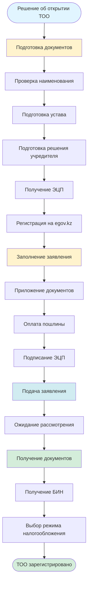
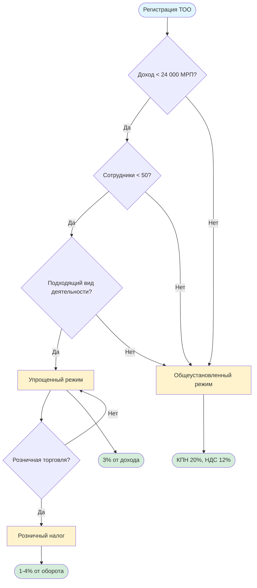

# Регистрация ТОО и налогообложение

## Описание услуги

Услуга включает консультации по регистрации Товарищества с ограниченной ответственностью (ТОО), выбору режима налогообложения, расчету налогов и открытию ТОО через портал egov.kz.

## Подзаголовки услуг

### 2.1 Что такое ТОО (Часть 1)
**Описание:** Общие сведения о Товариществе с ограниченной ответственностью.

**Инструкция:**
1. Изучить понятие ТОО:
   - ТОО - это коммерческая организация
   - Учредители несут ответственность в пределах своих вкладов
   - Минимальный уставный капитал - 100 МРП (на 2024 год)
2. Понять преимущества ТОО:
   - Ограниченная ответственность учредителей
   - Возможность ведения коммерческой деятельности
   - Простота управления
3. Изучить требования к учредителям:
   - Минимум 1 учредитель
   - Может быть физическое или юридическое лицо
   - Не требуется резидентство РК для учредителей

**Официальные источники:**
- Гражданский кодекс РК
- Закон РК "О товариществах с ограниченной и дополнительной ответственностью"

---

### 2.2 Что такое ТОО (Часть 2)
**Описание:** Детальная информация о структуре и управлении ТОО.

**Инструкция:**
1. Изучить органы управления ТОО:
   - Общее собрание участников
   - Исполнительный орган (директор)
   - Ревизионная комиссия (при необходимости)
2. Понять права и обязанности участников:
   - Право на участие в управлении
   - Право на получение прибыли
   - Обязанность по внесению вклада
3. Изучить процедуру изменения уставного капитала

**Официальные источники:**
- Гражданский кодекс РК
- Закон РК "О товариществах с ограниченной и дополнительной ответственностью"

---

### 2.3 Розничный налог
**Описание:** Режим налогообложения для розничной торговли.

**Инструкция:**
1. Понять условия применения:
   - Деятельность в сфере розничной торговли
   - Объем выручки не более установленного лимита
   - Специальный режим налогообложения
2. Изучить ставки налога:
   - Ставка устанавливается местными исполнительными органами
   - Обычно от 1% до 4% от оборота
3. Понять порядок уплаты:
   - Ежемесячная уплата
   - Подача декларации
   - Ведение учета

**Необходимые документы:**
- Документы о регистрации ТОО
- Документы о виде деятельности

**Официальные источники:**
- Налоговый кодекс РК
- [Комитет государственных доходов](https://kgd.gov.kz)

---

### 2.4 Общеустановленный режим
**Описание:** Общеустановленный режим налогообложения для ТОО.

**Инструкция:**
1. Изучить особенности режима:
   - Корпоративный подоходный налог (КПН) - 20%
   - Налог на добавленную стоимость (НДС) - 12%
   - Социальный налог
   - Налог на имущество
2. Понять требования:
   - Ведение полного бухгалтерского учета
   - Подача налоговых деклараций
   - Сдача отчетности
3. Изучить преимущества и недостатки:
   - Преимущества: возможность возмещения НДС, работа с крупными контрагентами
   - Недостатки: сложный учет, высокие налоги

**Необходимые документы:**
- Документы о регистрации ТОО
- Договоры с контрагентами

**Сроки выполнения:** Постоянно (ведение учета)

**Официальные источники:**
- Налоговый кодекс РК
- [КГД РК](https://kgd.gov.kz)

---

### 2.5 Режим упрощенка
**Описание:** Упрощенный режим налогообложения для малого бизнеса.

**Инструкция:**
1. Изучить условия применения:
   - Доход не более 24 000 МРП в год
   - Среднесписочная численность не более 50 человек
   - Определенные виды деятельности
2. Понять ставки налога:
   - 3% от дохода (для юридических лиц)
   - 2% от дохода (для ИП)
   - Или 1,5% от дохода минус вычеты
3. Изучить порядок уплаты:
   - Ежеквартальная уплата
   - Упрощенный учет
   - Подача декларации

**Необходимые документы:**
- Документы о регистрации ТОО
- Документы о доходах

**Сроки выполнения:** Ежеквартально

**Официальные источники:**
- Налоговый кодекс РК
- [КГД РК](https://kgd.gov.kz)

---

### 2.6 Как узнать режим ТОО
**Описание:** Проверка текущего режима налогообложения ТОО.

**Инструкция:**
1. Зайти на портал egov.kz
2. Авторизоваться с помощью ЭЦП
3. Перейти в раздел "Налоговые услуги"
4. Выбрать "Сведения о налогоплательщике"
5. Ввести БИН ТОО
6. Получить информацию о режиме налогообложения
7. Альтернативно: обратиться в налоговый орган лично

**Необходимые документы:**
- ЭЦП
- БИН ТОО

**Сроки выполнения:** 5-10 минут

**Официальные источники:**
- [egov.kz](https://egov.kz)
- [Налоговый кабинет](https://cabinet.salyk.kz)

---

### 2.7 Бухгалтерский калькулятор
**Описание:** Использование калькуляторов для расчета налогов и взносов.

**Инструкция:**
1. Найти официальные калькуляторы:
   - На сайте КГД РК
   - На портале egov.kz
   - В налоговом кабинете
2. Выбрать нужный калькулятор:
   - Калькулятор КПН
   - Калькулятор НДС
   - Калькулятор социального налога
   - Калькулятор ИПН
3. Ввести данные:
   - Доходы
   - Расходы
   - Другие параметры
4. Получить расчет
5. Использовать для планирования и отчетности

**Официальные источники:**
- [КГД РК - Калькуляторы](https://kgd.gov.kz)
- [Налоговый кабинет](https://cabinet.salyk.kz)

---

### 2.8 Дополнительная информация о ТОО
**Описание:** Дополнительные сведения о работе ТОО.

**Инструкция:**
1. Изучить требования к отчетности:
   - Бухгалтерская отчетность
   - Налоговые декларации
   - Статистическая отчетность
2. Понять требования к ведению учета:
   - Ведение учета доходов и расходов
   - Ведение кассовой книги
   - Хранение документов
3. Изучить процедуры:
   - Изменение устава
   - Изменение состава участников
   - Ликвидация ТОО

**Официальные источники:**
- Закон РК "О бухгалтерском учете и финансовой отчетности"
- Налоговый кодекс РК

---

### 2.9 Открытие ТОО
**Описание:** Пошаговая инструкция по регистрации ТОО через egov.kz.

**Инструкция:**
1. **Подготовка документов:**
   - Определить наименование ТОО (проверить уникальность)
   - Определить юридический адрес
   - Определить размер уставного капитала
   - Подготовить устав ТОО
   - Подготовить решение учредителя

2. **Регистрация на egov.kz:**
   - Зайти на портал egov.kz
   - Авторизоваться с помощью ЭЦП
   - Перейти в раздел "Регистрация юридических лиц"

3. **Заполнение заявления:**
   - Ввести данные учредителя
   - Ввести наименование ТОО
   - Ввести юридический адрес
   - Ввести размер уставного капитала
   - Приложить устав
   - Приложить решение учредителя

4. **Оплата государственной пошлины:**
   - Оплатить через портал egov.kz
   - Или через банк-партнер

5. **Подача заявления:**
   - Проверить все данные
   - Подписать ЭЦП
   - Отправить заявление

6. **Получение документов:**
   - Дождаться рассмотрения (обычно 3-5 рабочих дней)
   - Получить свидетельство о регистрации в электронном виде
   - Получить БИН

**Необходимые документы:**
- Удостоверение личности учредителя
- ИИН учредителя
- Устав ТОО
- Решение учредителя
- Документы на юридический адрес
- ЭЦП

**Сроки выполнения:** 3-5 рабочих дней

**Стоимость:** Государственная пошлина (уточнить на egov.kz)

**Официальные источники:**
- [egov.kz - Регистрация юридических лиц](https://egov.kz)
- [Министерство юстиции РК](https://www.gov.kz/memleket/entities/adilet)

---

## Визуальная схема процесса регистрации ТОО

## Схема выбора режима налогообложения

## Общие рекомендации

1. **Перед регистрацией ТОО:**
   - Изучите все режимы налогообложения
   - Рассчитайте налоговую нагрузку
   - Подготовьте все документы заранее

2. **При выборе режима:**
   - Учитывайте планируемый доход
   - Учитывайте количество сотрудников
   - Учитывайте вид деятельности

3. **После регистрации:**
   - Ведите учет с первого дня
   - Своевременно подавайте отчетность
   - Соблюдайте налоговое законодательство

## Полезные ссылки

- [egov.kz](https://egov.kz) - Портал электронного правительства
- [КГД РК](https://kgd.gov.kz) - Комитет государственных доходов
- [Налоговый кабинет](https://cabinet.salyk.kz) - Личный кабинет налогоплательщика
- [Министерство юстиции РК](https://www.gov.kz/memleket/entities/adilet) - Регистрация юридических лиц

