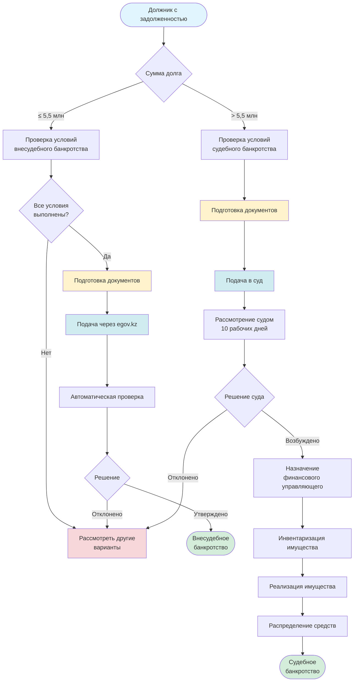

# Банкротство физических лиц

## Описание услуги

Услуга включает консультации по процедуре банкротства физических лиц в Республике Казахстан, помощь в подготовке документов и подаче заявления в суд.

## Подзаголовки услуг

### 3.2 Закон о банкротстве
**Описание:** Изучение законодательства о банкротстве физических лиц.

**Инструкция:**
1. Изучить основной закон:
   - Закон РК "О восстановлении платежеспособности и банкротстве граждан Республики Казахстан"
   - Гражданский кодекс РК (раздел о банкротстве)
   - Гражданский процессуальный кодекс РК
2. Понять основные понятия:
   - Банкротство
   - Должник
   - Кредитор
   - Финансовый управляющий
   - Процедуры банкротства
3. Изучить виды процедур:
   - Внесудебное банкротство
   - Судебное банкротство
   - Восстановление платежеспособности

**Официальные источники:**
- Закон РК "О восстановлении платежеспособности и банкротстве граждан Республики Казахстан"
- [КГД РК](https://kgd.gov.kz/ru/section/vosstanovlenie-platezhesposobnosti-i-bankrotstvo-grazhdan-respubliki-kazahstan)

---

### 3.3 Как подавать на банкротство
**Описание:** Пошаговая инструкция по подаче заявления о банкротстве.

**Инструкция:**

#### Внесудебное банкротство

1. **Проверка условий:**
   - Задолженность перед банками, МФО или коллекторами не превышает 5,5 млн тенге (1600 МРП)
   - Отсутствие платежей в течение 12 месяцев
   - Отсутствие зарегистрированного имущества
   - Проведение процедуры урегулирования задолженности
   - Отсутствие банкротства в течение последних 7 лет

2. **Подготовка документов:**
   - Удостоверение личности
   - ИИН
   - Документы о задолженностях
   - Документы о попытках урегулирования
   - Справка об отсутствии имущества

3. **Подача заявления:**
   - Зайти на портал egov.kz
   - Авторизоваться с помощью ЭЦП
   - Перейти в раздел "Банкротство физических лиц"
   - Выбрать "Внесудебное банкротство"
   - Заполнить заявление
   - Приложить документы
   - Подписать ЭЦП
   - Отправить заявление

4. **Рассмотрение:**
   - Автоматическая проверка условий
   - Принятие решения о признании банкротом
   - Получение решения в электронном виде

**Сроки выполнения:** 10-15 рабочих дней

#### Судебное банкротство

1. **Проверка условий:**
   - Задолженность превышает 5,5 млн тенге
   - Невозможность удовлетворить требования кредиторов
   - Отсутствие возможности восстановления платежеспособности

2. **Подготовка документов:**
   - Заявление о признании банкротом
   - Перечень всех кредиторов и дебиторов
   - Опись имущества должника
   - Перечень обязательств
   - Документы о доходах и расходах
   - Документы о попытках урегулирования
   - Документы, удостоверяющие личность

3. **Подача заявления:**
   - Подготовить заявление в суд по месту жительства
   - Приложить все документы
   - Подать лично в канцелярию суда или через egov.kz
   - Получить подтверждение о принятии

4. **Рассмотрение судом:**
   - Суд проверяет заявление (10 рабочих дней)
   - При возбуждении дела - назначение финансового управляющего
   - Реализация имущества
   - Распределение средств между кредиторами
   - Завершение процедуры

**Сроки выполнения:** 2-6 месяцев (в зависимости от сложности)

**Необходимые документы:**
- Удостоверение личности
- ИИН
- Перечень кредиторов с суммами задолженностей
- Опись имущества
- Документы о доходах
- Документы о попытках урегулирования

**Официальные источники:**
- Закон РК "О восстановлении платежеспособности и банкротстве граждан Республики Казахстан"
- [egov.kz](https://egov.kz)
- Суды РК

---

### 3.4 PDF файл
**Описание:** Работа с PDF-файлами документов для банкротства.

**Инструкция:**
1. **Подготовка документов:**
   - Собрать все необходимые документы
   - Отсканировать бумажные документы
   - Конвертировать в PDF

2. **Объединение документов:**
   - Использовать PDF-редактор для объединения
   - Или онлайн-сервисы для объединения PDF
   - Проверить порядок страниц

3. **Проверка качества:**
   - Убедиться, что все страницы читаемы
   - Проверить размер файла (не должен быть слишком большим)
   - Проверить наличие всех необходимых документов

4. **Подписание ЭЦП:**
   - Подписать PDF-файл ЭЦП
   - Сохранить подписанный файл

5. **Отправка:**
   - Приложить PDF-файл к заявлению
   - Отправить через egov.kz или в суд

**Официальные источники:**
- Инструкции по работе с PDF на egov.kz

---

## Визуальная схема процесса банкротства

## Сравнительная таблица процедур банкротства

| Критерий | Внесудебное банкротство | Судебное банкротство |
|----------|------------------------|----------------------|
| **Сумма долга** | ≤ 5,5 млн тенге | > 5,5 млн тенге |
| **Кредиторы** | Банки, МФО, коллекторы | Все кредиторы |
| **Имущество** | Отсутствие зарегистрированного | Любое имущество |
| **Срок неплатежей** | 12 месяцев | Любой |
| **Подача** | Через egov.kz | В суд |
| **Финансовый управляющий** | Не требуется | Назначается судом |
| **Реализация имущества** | Не требуется | Производится |
| **Сроки** | 10-15 дней | 2-6 месяцев |
| **Стоимость** | Минимальная | Включает вознаграждение управляющего |

## Последствия банкротства

### Положительные последствия:
- ✅ Списание долгов
- ✅ Прекращение взыскания
- ✅ Защита от кредиторов
- ✅ Возможность начать с чистого листа

### Отрицательные последствия:
- ❌ Ограничения на получение кредитов (до 7 лет)
- ❌ Ограничения на выезд за границу (при судебном банкротстве)
- ❌ Потеря имущества (при судебном банкротстве)
- ❌ Ограничения на занятие определенными видами деятельности

## Общие рекомендации

1. **Перед подачей заявления:**
   - Изучите все варианты (внесудебное, судебное, восстановление платежеспособности)
   - Соберите все необходимые документы
   - Проверьте соответствие условиям

2. **При подготовке документов:**
   - Будьте честны и предоставляйте полную информацию
   - Проверьте правильность всех данных
   - Сохраните копии всех документов

3. **После признания банкротом:**
   - Соблюдайте все ограничения
   - Ведите финансовую дисциплину
   - Планируйте финансовое будущее

## Полезные ссылки

- [egov.kz - Банкротство физических лиц](https://egov.kz)
- [КГД РК - Банкротство](https://kgd.gov.kz/ru/section/vosstanovlenie-platezhesposobnosti-i-bankrotstvo-grazhdan-respubliki-kazahstan)
- [Верховный суд РК](https://sud.gov.kz)
- Закон РК "О восстановлении платежеспособности и банкротстве граждан Республики Казахстан"

