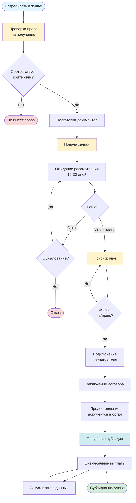

# Получение жилищной субсидии

## Описание услуги

Услуга включает консультации и помощь в получении жилищной субсидии для аренды жилья в Республике Казахстан. Процедура включает подачу заявки, рассмотрение, поиск жилья, заключение договора и получение субсидии.

## Подзаголовки услуг

### 5.1 Ознакомление
**Описание:** Общее ознакомление с процедурой получения жилищной субсидии.

**Инструкция:**
1. Изучить условия получения субсидии:
   - Кто имеет право на получение
   - Какие документы необходимы
   - Размер субсидии
   - Сроки рассмотрения
2. Понять процесс:
   - Подача заявки
   - Рассмотрение заявки
   - Поиск жилья
   - Заключение договора
   - Получение субсидии
3. Изучить требования к жилью:
   - Требования к площади
   - Требования к состоянию
   - Требования к арендодателю

**Официальные источники:**
- Закон РК "О жилищных отношениях"
- Постановления Правительства РК о жилищных субсидиях
- Местные исполнительные органы

---

### 5.2 Подача заявки
**Описание:** Пошаговая инструкция по подаче заявки на получение жилищной субсидии.

**Инструкция:**
1. **Проверка права на получение:**
   - Проверить соответствие критериям (доход, состав семьи, отсутствие жилья)
   - Изучить требования местных органов

2. **Подготовка документов:**
   - Удостоверение личности всех членов семьи
   - ИИН всех членов семьи
   - Справка о составе семьи
   - Справки о доходах всех членов семьи за последние 6 месяцев
   - Справка об отсутствии жилья в собственности
   - Документы о семейном положении
   - Другие документы по требованию

3. **Подача заявки:**
   - **Способ 1: Через egov.kz**
     - Зайти на портал egov.kz
     - Авторизоваться с помощью ЭЦП
     - Перейти в раздел "Жилищные субсидии"
     - Заполнить электронное заявление
     - Приложить сканы документов
     - Подписать ЭЦП
     - Отправить заявление
   
   - **Способ 2: Лично**
     - Обратиться в местный исполнительный орган (акимат)
     - Получить бланк заявления
     - Заполнить заявление
     - Приложить документы
     - Подать заявление

4. **Получение подтверждения:**
   - Получить номер заявки
   - Сохранить подтверждение о принятии

**Необходимые документы:**
- Удостоверение личности всех членов семьи
- ИИН всех членов семьи
- Справка о составе семьи
- Справки о доходах
- Справка об отсутствии жилья
- Документы о семейном положении

**Сроки выполнения:** 1 день (подача заявки)

**Официальные источники:**
- [egov.kz](https://egov.kz)
- Местные исполнительные органы (акиматы)

---

### 5.3 Рассмотрение заявки
**Описание:** Процесс рассмотрения заявки на жилищную субсидию.

**Инструкция:**
1. **Ожидание рассмотрения:**
   - Срок рассмотрения обычно 15-30 рабочих дней
   - Отслеживать статус на egov.kz
   - Или ждать уведомления

2. **Проверка документов:**
   - Органы проверяют поданные документы
   - Могут запросить дополнительные документы
   - Могут провести проверку жилищных условий

3. **Принятие решения:**
   - Решение о предоставлении субсидии
   - Или отказ с указанием причин

4. **Получение уведомления:**
   - Получить уведомление о решении
   - При положительном решении - получить сертификат или уведомление
   - При отказе - изучить причины и возможность обжалования

**Сроки выполнения:** 15-30 рабочих дней

**Официальные источники:**
- Местные исполнительные органы
- [egov.kz](https://egov.kz)

---

### 5.4 Поиск жилья и подключение арендодателя
**Описание:** Поиск подходящего жилья и работа с арендодателем.

**Инструкция:**
1. **Поиск жилья:**
   - Использовать специализированные сайты
   - Обратиться в агентства недвижимости
   - Искать через знакомых
   - Проверить соответствие требованиям:
     - Площадь должна соответствовать нормам
     - Состояние должно быть удовлетворительным
     - Расположение должно быть удобным

2. **Проверка арендодателя:**
   - Проверить право собственности на жилье
   - Проверить документы арендодателя
   - Убедиться, что арендодатель согласен на субсидию

3. **Подключение арендодателя:**
   - Объяснить арендодателю условия субсидии
   - Получить согласие арендодателя
   - Предоставить арендодателю информацию о процедуре
   - Договориться о порядке оплаты

4. **Подготовка документов от арендодателя:**
   - Документы о праве собственности
   - Документы арендодателя (удостоверение, ИИН)
   - Согласие на участие в программе субсидий

**Сроки выполнения:** 1-2 месяца (поиск жилья)

**Официальные источники:**
- Местные исполнительные органы
- Агентства недвижимости

---

### 5.5 Заключение договора
**Описание:** Заключение договора аренды жилья для получения субсидии.

**Инструкция:**
1. **Подготовка договора:**
   - Использовать типовой договор аренды
   - Или подготовить договор с учетом требований субсидии
   - Указать все условия:
     - Стороны договора
     - Предмет договора (адрес, площадь)
     - Срок аренды
     - Размер арендной платы
     - Порядок оплаты
     - Права и обязанности сторон

2. **Проверка договора:**
   - Проверить соответствие требованиям программы субсидий
   - Убедиться, что все условия указаны
   - Проверить правильность данных

3. **Подписание договора:**
   - Подписать договор обеими сторонами
   - Заверить у нотариуса (если требуется)
   - Сделать копии для всех сторон

4. **Регистрация договора:**
   - Зарегистрировать договор в органах (если требуется)
   - Предоставить копию договора в орган, предоставляющий субсидию

**Необходимые документы:**
- Договор аренды
- Документы о праве собственности арендодателя
- Документы сторон

**Сроки выполнения:** 1-2 дня

**Официальные источники:**
- Гражданский кодекс РК
- Закон РК "О жилищных отношениях"

---

### 5.6 Получение субсидии
**Описание:** Процедура получения жилищной субсидии после заключения договора.

**Инструкция:**
1. **Предоставление документов:**
   - Предоставить в орган, предоставляющий субсидию:
     - Копию договора аренды
     - Документы арендодателя
     - Документы о праве собственности на жилье
     - Другие документы по требованию

2. **Проверка документов:**
   - Органы проверяют предоставленные документы
   - Проверяют соответствие жилья требованиям
   - Проверяют договор аренды

3. **Начисление субсидии:**
   - Органы начисляют субсидию
   - Определяют размер субсидии
   - Определяют срок предоставления

4. **Получение субсидии:**
   - Субсидия может перечисляться:
     - На счет арендодателя
     - На счет получателя субсидии
   - Получать ежемесячные выплаты
   - Отчитываться о использовании (если требуется)

**Сроки выполнения:** 10-15 рабочих дней после предоставления документов

**Официальные источники:**
- Местные исполнительные органы
- [egov.kz](https://egov.kz)

---

### 5.7 Актуализация
**Описание:** Процедура актуализации данных и продления субсидии.

**Инструкция:**
1. **Периодическая актуализация:**
   - Предоставлять актуальные справки о доходах
   - Сообщать об изменениях в составе семьи
   - Сообщать об изменениях в жилищных условиях

2. **Продление субсидии:**
   - Подавать заявление на продление (если требуется)
   - Предоставлять актуальные документы
   - Обновлять договор аренды (если требуется)

3. **Изменение условий:**
   - Сообщать об изменении адреса
   - Сообщать об изменении размера арендной платы
   - Сообщать о других изменениях

**Сроки выполнения:** По мере необходимости

**Официальные источники:**
- Местные исполнительные органы

---

### 5.8 Новые фишки
**Описание:** Новые возможности и изменения в программе жилищных субсидий.

**Инструкция:**
1. **Отслеживание изменений:**
   - Регулярно проверять официальные сайты
   - Следить за новостями о программе
   - Изучать новые возможности

2. **Использование новых возможностей:**
   - Использовать электронные сервисы
   - Использовать мобильные приложения
   - Использовать упрощенные процедуры

3. **Консультации:**
   - Обращаться за консультациями в органы
   - Использовать горячие линии
   - Использовать онлайн-консультации

**Официальные источники:**
- [egov.kz](https://egov.kz)
- Местные исполнительные органы
- Официальные новости и объявления

---

## Визуальная схема процесса получения субсидии

## Требования к получателю субсидии

- ✅ Гражданство или постоянное проживание в РК
- ✅ Низкий доход (ниже установленного уровня)
- ✅ Отсутствие жилья в собственности
- ✅ Соответствие требованиям по составу семьи
- ✅ Отсутствие задолженностей по коммунальным услугам (в некоторых случаях)

## Требования к жилью

- ✅ Соответствие санитарным нормам
- ✅ Соответствие площади нормам (на человека)
- ✅ Наличие всех коммуникаций
- ✅ Пригодность для проживания
- ✅ Соответствие требованиям программы

## Общие рекомендации

1. **При подготовке документов:**
   - Собирайте документы заранее
   - Проверяйте актуальность справок
   - Делайте копии всех документов

2. **При поиске жилья:**
   - Изучите требования к жилью
   - Проверяйте документы арендодателя
   - Убедитесь в соответствии требованиям

3. **При получении субсидии:**
   - Соблюдайте условия договора
   - Своевременно актуализируйте данные
   - Сообщайте об изменениях

## Полезные ссылки

- [egov.kz - Жилищные субсидии](https://egov.kz)
- Местные исполнительные органы (акиматы)
- Министерство индустрии и инфраструктурного развития РК

