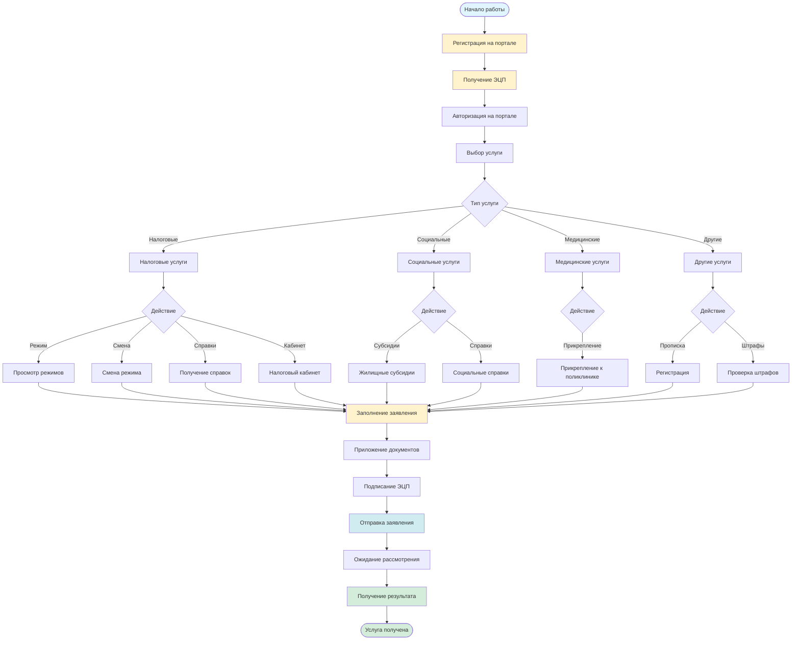

# Работа с порталом eGov

## Описание услуги

Услуга включает консультации и помощь в работе с порталом электронного правительства Республики Казахстан (egov.kz), включая регистрацию, получение ЭЦП, работу с различными сервисами и получение государственных услуг.

## Подзаголовки услуг

### 6.1 Режимы налогообложения
**Описание:** Работа с информацией о режимах налогообложения через портал eGov.

**Инструкция:**
1. **Вход на портал:**
   - Зайти на egov.kz
   - Авторизоваться с помощью ЭЦП или через мобильное приложение

2. **Переход в налоговый раздел:**
   - Перейти в раздел "Налоговые услуги"
   - Выбрать "Режимы налогообложения"

3. **Получение информации:**
   - Просмотреть доступные режимы
   - Изучить условия применения каждого режима
   - Получить информацию о ставках налогов
   - Получить информацию о требованиях

4. **Использование калькуляторов:**
   - Использовать калькуляторы для расчета налогов
   - Сравнить налоговую нагрузку при разных режимах

**Официальные источники:**
- [egov.kz](https://egov.kz)
- [Налоговый кабинет](https://cabinet.salyk.kz)
- [КГД РК](https://kgd.gov.kz)

---

### 6.2 Смена режима - разъяснение
**Описание:** Разъяснение процедуры смены режима налогообложения.

**Инструкция:**
1. **Изучение условий:**
   - Изучить условия смены режима
   - Понять ограничения и сроки
   - Изучить последствия смены

2. **Подготовка документов:**
   - Подготовить необходимые документы
   - Проверить соответствие условиям

3. **Подача заявления:**
   - Зайти на egov.kz
   - Авторизоваться
   - Перейти в раздел "Смена режима налогообложения"
   - Заполнить заявление
   - Приложить документы
   - Подписать ЭЦП
   - Отправить заявление

4. **Получение решения:**
   - Дождаться рассмотрения
   - Получить уведомление о решении

**Сроки выполнения:** 5-10 рабочих дней

**Официальные источники:**
- [egov.kz](https://egov.kz)
- [КГД РК](https://kgd.gov.kz)

---

### 6.3 Как связан eGov с другими госсайтами
**Описание:** Понимание взаимосвязи портала eGov с другими государственными сайтами.

**Инструкция:**
1. **Изучение интеграции:**
   - Понять, что eGov - единая точка доступа
   - Изучить связанные порталы:
     - Налоговый кабинет (cabinet.salyk.kz)
     - Портал занятости
     - Портал здравоохранения
     - Портал образования
     - Другие порталы

2. **Использование единого входа:**
   - Использовать ЭЦП для входа на все порталы
   - Использовать единый профиль
   - Синхронизировать данные

3. **Навигация между порталами:**
   - Переходить между порталами через eGov
   - Использовать единую авторизацию
   - Получать услуги на разных порталах

**Официальные источники:**
- [egov.kz](https://egov.kz)
- Официальные порталы государственных органов

---

### 6.4 Новый налоговый кабинет
**Описание:** Работа с новым налоговым кабинетом через eGov.

**Инструкция:**
1. **Доступ к налоговому кабинету:**
   - Зайти на egov.kz
   - Авторизоваться
   - Перейти в раздел "Налоговый кабинет"
   - Или напрямую на cabinet.salyk.kz

2. **Использование функций:**
   - Просмотр налоговых обязательств
   - Подача налоговых деклараций
   - Оплата налогов
   - Получение справок
   - Просмотр истории платежей

3. **Работа с документами:**
   - Загружать документы
   - Получать документы
   - Подписывать документы ЭЦП

**Официальные источники:**
- [Налоговый кабинет](https://cabinet.salyk.kz)
- [egov.kz](https://egov.kz)

---

### 6.5 Предоставление справок
**Описание:** Получение различных справок через портал eGov.

**Инструкция:**
1. **Выбор справки:**
   - Зайти на egov.kz
   - Авторизоваться
   - Перейти в раздел "Справки"
   - Выбрать нужную справку

2. **Заполнение заявления:**
   - Заполнить электронное заявление
   - Указать необходимые данные
   - Выбрать способ получения (электронно или лично)

3. **Получение справки:**
   - **Электронно:**
     - Получить справку в личном кабинете
     - Скачать PDF-файл
     - Подписать ЭЦП (если требуется)
   
   - **Лично:**
     - Получить уведомление о готовности
     - Прийти в указанное место
     - Получить справку

**Виды справок:**
- Справка о доходах
- Справка о составе семьи
- Справка о месте жительства
- Справка об отсутствии судимости
- Другие справки

**Сроки выполнения:** 1-5 рабочих дней (в зависимости от справки)

**Официальные источники:**
- [egov.kz](https://egov.kz)

---

### 6.6 Прикрепление к поликлинике
**Описание:** Прикрепление к поликлинике через портал eGov.

**Инструкция:**
1. **Выбор поликлиники:**
   - Зайти на egov.kz
   - Авторизоваться
   - Перейти в раздел "Здравоохранение"
   - Выбрать "Прикрепление к поликлинике"

2. **Поиск поликлиники:**
   - Найти поликлинику по адресу
   - Или по названию
   - Проверить доступность прикрепления

3. **Подача заявления:**
   - Заполнить заявление
   - Указать данные
   - Приложить документы (если требуется)
   - Подписать ЭЦП
   - Отправить заявление

4. **Получение подтверждения:**
   - Получить уведомление о прикреплении
   - Сохранить подтверждение

**Необходимые документы:**
- Удостоверение личности
- ИИН
- Справка о месте жительства (в некоторых случаях)

**Сроки выполнения:** 1-3 рабочих дня

**Официальные источники:**
- [egov.kz](https://egov.kz)
- Министерство здравоохранения РК

---

### 6.7 Проверка наличия штрафов
**Описание:** Проверка наличия административных штрафов через портал eGov.

**Инструкция:**
1. **Вход на портал:**
   - Зайти на egov.kz
   - Авторизоваться

2. **Переход в раздел:**
   - Перейти в раздел "Проверка штрафов"
   - Или "Административные правонарушения"

3. **Проверка:**
   - Ввести ИИН
   - Или система автоматически покажет штрафы
   - Просмотреть список штрафов
   - Получить детальную информацию

4. **Оплата штрафов:**
   - Выбрать штраф для оплаты
   - Оплатить через портал
   - Получить подтверждение об оплате

**Сроки выполнения:** Мгновенно

**Официальные источники:**
- [egov.kz](https://egov.kz)
- Комитет административной полиции МВД РК

---

### 6.8 Прописка
**Описание:** Регистрация по месту жительства (прописка) через портал eGov.

**Инструкция:**
1. **Подготовка документов:**
   - Удостоверение личности
   - ИИН
   - Документы на жилье (договор аренды, право собственности)
   - Согласие собственника (если аренда)

2. **Подача заявления:**
   - Зайти на egov.kz
   - Авторизоваться
   - Перейти в раздел "Регистрация по месту жительства"
   - Заполнить заявление
   - Приложить документы
   - Подписать ЭЦП
   - Отправить заявление

3. **Рассмотрение:**
   - Дождаться рассмотрения (обычно 3-5 дней)
   - Получить уведомление о решении

4. **Получение справки:**
   - Получить справку о регистрации
   - Электронно или лично

**Необходимые документы:**
- Удостоверение личности
- ИИН
- Документы на жилье
- Согласие собственника (если требуется)

**Сроки выполнения:** 3-5 рабочих дней

**Официальные источники:**
- [egov.kz](https://egov.kz)
- Министерство внутренних дел РК

---

### 6.9 ЭЦП - открыть (Часть 1)
**Описание:** Получение электронной цифровой подписи (ЭЦП) через портал eGov.

**Инструкция:**
1. **Выбор удостоверяющего центра:**
   - Изучить список аккредитованных центров
   - Выбрать подходящий центр
   - Или использовать НУЦ РК

2. **Подача заявления:**
   - Зайти на портал удостоверяющего центра
   - Или через egov.kz
   - Заполнить заявление
   - Указать данные

3. **Подготовка документов:**
   - Удостоверение личности
   - ИИН
   - СНИЛС (при наличии)
   - Фотография (если требуется)

4. **Оплата:**
   - Оплатить услугу
   - Получить подтверждение об оплате

**Необходимые документы:**
- Удостоверение личности
- ИИН
- СНИЛС (при наличии)

**Сроки выполнения:** 1-3 рабочих дня

**Официальные источники:**
- [НУЦ РК](https://pki.gov.kz)
- [egov.kz](https://egov.kz)

---

### 6.10 ЭЦП - открыть (Часть 2)
**Описание:** Активация и использование ЭЦП.

**Инструкция:**
1. **Получение ЭЦП:**
   - Получить носитель с ЭЦП
   - Или получить облачную ЭЦП
   - Получить PIN-код

2. **Установка программного обеспечения:**
   - Скачать и установить ПО для работы с ЭЦП
   - Настроить ПО
   - Установить сертификат

3. **Активация:**
   - Вставить носитель (если USB-токен)
   - Ввести PIN-код
   - Активировать ЭЦП

4. **Использование:**
   - Использовать для подписания документов
   - Использовать для авторизации на порталах
   - Использовать для получения услуг

**Официальные источники:**
- [НУЦ РК](https://pki.gov.kz)
- Инструкции удостоверяющего центра

---

### 6.11 Обзор eGov
**Описание:** Общий обзор возможностей портала eGov.

**Инструкция:**
1. **Изучение структуры портала:**
   - Изучить главную страницу
   - Изучить разделы и категории
   - Изучить поиск услуг

2. **Регистрация и авторизация:**
   - Зарегистрироваться на портале
   - Получить ЭЦП
   - Научиться авторизовываться

3. **Основные разделы:**
   - Налоговые услуги
   - Социальные услуги
   - Юридические услуги
   - Медицинские услуги
   - Образовательные услуги
   - Другие услуги

4. **Использование услуг:**
   - Найти нужную услугу
   - Изучить требования
   - Подать заявление
   - Отслеживать статус
   - Получить результат

**Официальные источники:**
- [egov.kz](https://egov.kz)
- Обучающие материалы на портале

---

## Визуальная схема работы с eGov

## Основные разделы портала eGov

1. **Налоговые услуги:**
   - Режимы налогообложения
   - Налоговый кабинет
   - Подача деклараций
   - Оплата налогов
   - Получение справок

2. **Социальные услуги:**
   - Жилищные субсидии
   - Социальные выплаты
   - Пенсионные услуги
   - Другие социальные услуги

3. **Медицинские услуги:**
   - Прикрепление к поликлинике
   - Запись к врачу
   - Получение справок
   - Медицинские услуги

4. **Образовательные услуги:**
   - Запись в школу/детский сад
   - Получение справок
   - Образовательные услуги

5. **Юридические услуги:**
   - Регистрация юридических лиц
   - Регистрация ИП
   - Другие юридические услуги

6. **Другие услуги:**
   - Регистрация по месту жительства
   - Проверка штрафов
   - Получение различных справок
   - Другие государственные услуги

## Общие рекомендации

1. **Регистрация:**
   - Зарегистрируйтесь на портале заранее
   - Получите ЭЦП для полного доступа
   - Изучите структуру портала

2. **Работа с услугами:**
   - Изучайте требования перед подачей
   - Подготавливайте документы заранее
   - Сохраняйте подтверждения

3. **Безопасность:**
   - Храните ЭЦП в безопасном месте
   - Не передавайте PIN-код третьим лицам
   - Регулярно обновляйте пароли

## Полезные ссылки

- [egov.kz](https://egov.kz) - Портал электронного правительства
- [НУЦ РК](https://pki.gov.kz) - Национальный удостоверяющий центр
- [Налоговый кабинет](https://cabinet.salyk.kz) - Личный кабинет налогоплательщика
- [КГД РК](https://kgd.gov.kz) - Комитет государственных доходов

