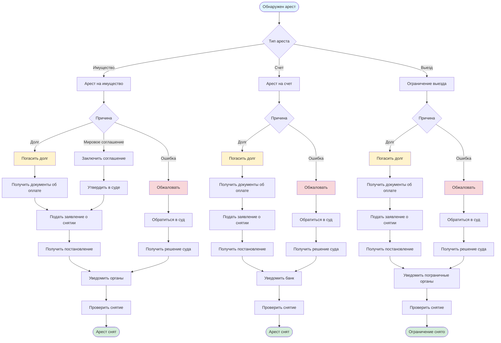
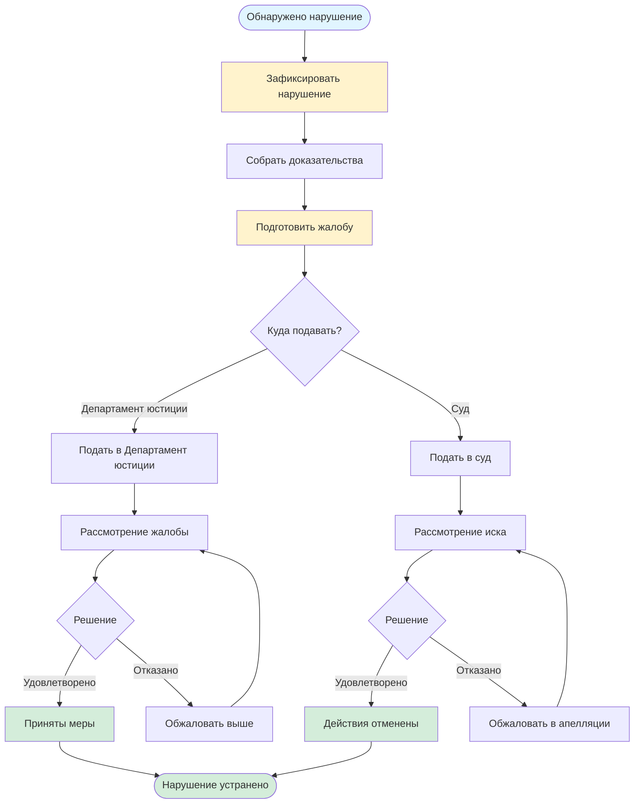

# Дополнительные юридические услуги

## Описание услуги

Услуга включает помощь в снятии арестов с имущества и счетов, снятии ограничений на выезд, обжаловании действий судебных исполнителей, отмене исполнительных надписей и других дополнительных юридических услугах.

## Подзаголовки услуг

### 7.1 Снятие ареста с имущества
**Описание:** Процедура снятия ареста, наложенного на недвижимое и движимое имущество должника.

**Инструкция:**
1. **Определение причины ареста:**
   - Получить информацию о постановлении об аресте
   - Уточнить основание наложения ареста
   - Связаться с судебным исполнителем

2. **Способы снятия ареста:**
   - **Полное погашение задолженности:**
     - Оплатить всю сумму долга
     - Получить документы, подтверждающие оплату
     - Предоставить документы судебному исполнителю
     - Подать заявление о снятии ареста
   
   - **Заключение мирового соглашения:**
     - Договориться с взыскателем о мировом соглашении
     - Утвердить соглашение в суде
     - Предоставить судебному исполнителю решение суда
   
   - **Отмена судебного акта:**
     - Обжаловать решение суда
     - При отмене решения - арест снимается автоматически

3. **Подача заявления:**
   - Подготовить заявление о снятии ареста
   - Приложить документы, подтверждающие основание
   - Подать судебному исполнителю
   - Получить постановление о снятии ареста

4. **Регистрация снятия ареста:**
   - Судебный исполнитель направляет постановление в органы регистрации
   - Проверить снятие ареста в органах регистрации

**Необходимые документы:**
- Постановление об аресте
- Документы, подтверждающие оплату долга (если погашен)
- Решение суда о мировом соглашении (если применимо)
- Решение суда об отмене (если применимо)
- Заявление о снятии ареста

**Сроки выполнения:** 5-10 рабочих дней после подачи заявления

**Официальные источники:**
- Закон РК "Об исполнительном производстве и статусе судебных исполнителей"
- [egov.kz](https://egov.kz)

---

### 7.2 Снятие ареста со счетов в банке
**Описание:** Процедура снятия ареста, наложенного на банковские счета должника.

**Инструкция:**
1. **Проверка ареста:**
   - Обратиться в банк для получения информации об аресте
   - Получить копию постановления об аресте
   - Уточнить сумму ареста

2. **Снятие ареста:**
   - **При полном погашении:**
     - Оплатить задолженность
     - Получить подтверждающие документы
     - Предоставить судебному исполнителю
     - Получить постановление о снятии ареста
     - Предоставить постановление в банк
   
   - **При частичном погашении:**
     - Договориться с взыскателем о частичном снятии
     - Получить согласие судебного исполнителя
     - Получить постановление о частичном снятии

3. **Уведомление банка:**
   - Судебный исполнитель направляет постановление в банк
   - Или предоставить постановление в банк лично
   - Банк снимает арест в течение 1-3 рабочих дней

4. **Проверка:**
   - Проверить снятие ареста через банк
   - Убедиться, что средства доступны

**Необходимые документы:**
- Постановление об аресте
- Документы об оплате
- Постановление о снятии ареста
- Документы для банка

**Сроки выполнения:** 3-7 рабочих дней

**Официальные источники:**
- Закон РК "Об исполнительном производстве"
- Нормативные акты Национального банка РК

---

### 7.3 Снятие ограничения на выезд за границу
**Описание:** Процедура снятия ограничения на выезд за границу, наложенного в связи с задолженностью.

**Инструкция:**
1. **Проверка ограничения:**
   - Проверить наличие ограничения на egov.kz
   - Или обратиться в органы пограничного контроля
   - Получить информацию о сумме задолженности

2. **Погашение задолженности:**
   - Оплатить всю сумму долга
   - Получить документы, подтверждающие оплату
   - Сохранить все квитанции и чеки

3. **Обращение к судебному исполнителю:**
   - Предоставить документы об оплате
   - Подать заявление о снятии ограничения
   - Получить постановление о снятии ограничения

4. **Направление в органы:**
   - Судебный исполнитель направляет постановление в органы пограничного контроля
   - Обычно в течение 3-5 рабочих дней
   - Проверить снятие ограничения на egov.kz

5. **Проверка перед выездом:**
   - Проверить статус на egov.kz
   - Или связаться с органами пограничного контроля
   - Убедиться, что ограничение снято

**Необходимые документы:**
- Документы об оплате задолженности
- Заявление о снятии ограничения
- Постановление о снятии ограничения

**Сроки выполнения:** 5-10 рабочих дней после оплаты

**Официальные источники:**
- Закон РК "Об исполнительном производстве"
- [egov.kz - Проверка ограничения выезда](https://egov.kz)

---

### 7.4 Обжалование действий судебных исполнителей
**Описание:** Процедура обжалования незаконных действий или бездействия судебных исполнителей.

**Инструкция:**
1. **Подготовка жалобы:**
   - Документально зафиксировать нарушение
   - Собрать доказательства (документы, фото, видео, свидетельские показания)
   - Подготовить письменную жалобу с описанием нарушения

2. **Подача жалобы:**
   - **В Департамент юстиции:**
     - Подать жалобу в Департамент юстиции региона
     - Приложить все доказательства
     - Получить подтверждение о принятии
   
   - **В суд:**
     - Подать административный иск в суд
     - Указать незаконные действия
     - Приложить доказательства

3. **Рассмотрение жалобы:**
   - Департамент юстиции или суд рассматривает жалобу
   - Может быть назначена проверка
   - Могут быть запрошены дополнительные документы

4. **Получение решения:**
   - Получить решение по жалобе
   - При удовлетворении - действия будут отменены
   - При отказе - можно обжаловать в вышестоящий орган

**Необходимые документы:**
- Жалоба с описанием нарушения
- Доказательства нарушения
- Копии документов, связанных с нарушением
- Документы, подтверждающие права

**Сроки выполнения:** 15-30 дней на рассмотрение

**Официальные источники:**
- Закон РК "Об исполнительном производстве"
- Кодекс об административных правонарушениях РК
- Департаменты юстиции регионов

---

### 7.5 Отмена исполнительной надписи нотариуса
**Описание:** Процедура оспаривания и отмены исполнительной надписи нотариуса в судебном порядке.

**Инструкция:**
1. **Изучение исполнительной надписи:**
   - Получить копию исполнительной надписи
   - Изучить основания для взыскания
   - Определить основания для оспаривания

2. **Подготовка документов:**
   - Собрать документы, подтверждающие возражения:
     - Квитанции об оплате (если долг погашен)
     - Договоры и соглашения
     - Другие документы, опровергающие требования

3. **Подача иска в суд:**
   - Подготовить исковое заявление об оспаривании исполнительной надписи
   - Указать основания для отмены:
     - Нарушение процедуры
     - Отсутствие оснований для взыскания
     - Погашение задолженности
     - Истечение срока давности
   - Приложить все документы
   - Подать в суд по месту нахождения нотариуса

4. **Участие в судебном процессе:**
   - Участвовать в судебных заседаниях
   - Предоставить доказательства
   - Обосновать требования

5. **Получение решения:**
   - Получить решение суда
   - При удовлетворении иска - исполнительная надпись отменяется
   - Предоставить решение судебному исполнителю

**Необходимые документы:**
- Копия исполнительной надписи
- Документы, подтверждающие возражения
- Исковое заявление
- Другие документы по требованию суда

**Сроки выполнения:** 1-3 месяца (в зависимости от сложности дела)

**Официальные источники:**
- Закон РК "О нотариате"
- Гражданский процессуальный кодекс РК
- Суды РК

---

### 7.6 Освобождение имущества от ареста
**Описание:** Процедура освобождения имущества от ареста, если арест наложен неправомерно или на имущество, не принадлежащее должнику.

**Инструкция:**
1. **Определение оснований:**
   - Имущество не принадлежит должнику
   - Арест наложен неправомерно
   - Имущество не подлежит взысканию по закону
   - Нарушена процедура наложения ареста

2. **Подготовка документов:**
   - Документы, подтверждающие право собственности
   - Документы, подтверждающие неправомерность ареста
   - Другие доказательства

3. **Подача иска в суд:**
   - Подготовить исковое заявление об освобождении имущества от ареста
   - Указать основания
   - Приложить документы
   - Подать в суд по месту нахождения имущества

4. **Участие в процессе:**
   - Участвовать в судебных заседаниях
   - Предоставить доказательства
   - Обосновать требования

5. **Получение решения:**
   - Получить решение суда об освобождении от ареста
   - Предоставить решение судебному исполнителю
   - Судебный исполнитель снимает арест

**Необходимые документы:**
- Документы о праве собственности
- Документы, подтверждающие неправомерность ареста
- Исковое заявление
- Другие документы

**Сроки выполнения:** 1-3 месяца

**Официальные источники:**
- Гражданский процессуальный кодекс РК
- Закон РК "Об исполнительном производстве"

---

### 7.7 Получение рассрочки или отсрочки исполнения
**Описание:** Процедура получения рассрочки или отсрочки исполнения обязательств перед взыскателем.

**Инструкция:**
1. **Подготовка заявления:**
   - Подготовить заявление о предоставлении рассрочки/отсрочки
   - Указать причины (сложное финансовое положение, болезнь и т.д.)
   - Предложить график платежей (для рассрочки)

2. **Сбор документов:**
   - Справки о доходах
   - Медицинские справки (если применимо)
   - Документы о составе семьи
   - Другие документы, подтверждающие сложное положение

3. **Подача заявления:**
   - Подать заявление судебному исполнителю
   - Или в суд (если требуется судебное решение)
   - Приложить все документы

4. **Рассмотрение:**
   - Судебный исполнитель или суд рассматривает заявление
   - Может быть запрошена дополнительная информация
   - Учитываются интересы обеих сторон

5. **Получение решения:**
   - Получить постановление или решение о рассрочке/отсрочке
   - Соблюдать установленный график
   - При нарушении - рассрочка может быть отменена

**Необходимые документы:**
- Заявление о рассрочке/отсрочке
- Справки о доходах
- Документы, подтверждающие причины
- Предложенный график платежей

**Сроки выполнения:** 10-15 рабочих дней

**Официальные источники:**
- Закон РК "Об исполнительном производстве"
- Гражданский процессуальный кодекс РК

---

## Визуальная схема процесса снятия ареста

## Схема обжалования действий судебных исполнителей

## Общие рекомендации

1. **При обнаружении ареста:**
   - Немедленно выясните причину
   - Получите копии всех документов
   - Не игнорируйте арест

2. **При погашении долга:**
   - Сохраняйте все документы об оплате
   - Получайте официальные подтверждения
   - Проверяйте снятие ареста

3. **При обжаловании:**
   - Документируйте все нарушения
   - Собирайте доказательства
   - Соблюдайте сроки обжалования

4. **Работа с документами:**
   - Делайте копии всех документов
   - Ведите учет всех обращений
   - Сохраняйте подтверждения

## Полезные ссылки

- [egov.kz](https://egov.kz) - Портал электронного правительства
- Закон РК "Об исполнительном производстве и статусе судебных исполнителей"
- Департаменты юстиции регионов
- [Верховный суд РК](https://sud.gov.kz)

